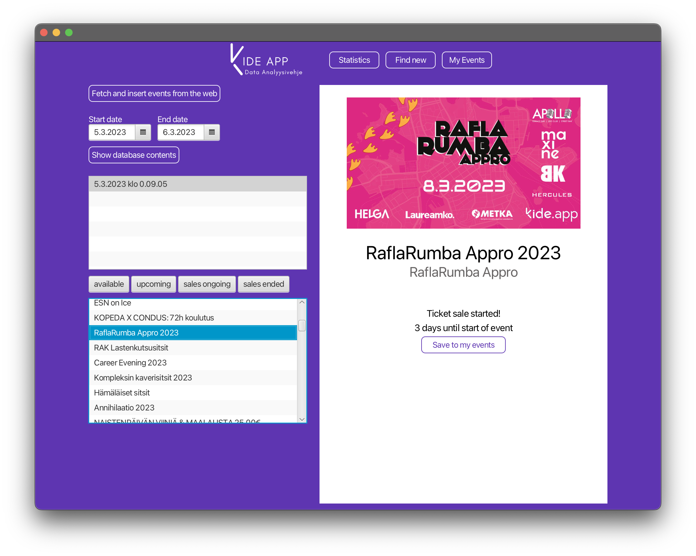

# Kideappdataanalyysivehje

> Ohjelmistotuotantoprojekti 1 TX00CF81-3018
>
> Atte Räisänen, Henri Vuento, Perttu Vaarala, Arttu Pennanen

[testien status](http://10.114.32.28:8080/job/kideappdataanalyysivehje/badge/icon)

## Visio

Kideappdataanalyysivehje on maven java työpöytäsovellus, jolla voidaan tarkastella [kide.app](https://kide.app/) tapahtumien muutoksia korkealta tasolta ajan funktiona.

Sovelluksella pystyy pitämään kirjaa käyttäjää kiinnostavista tapahtumista tallentamalla niitä omaan listaan sekä saamalla niiden tapahtuma- sekä myyntipäivämäärinä ilmoituksia.

<p>

<em>Datanäkymä</em>
</p>
<p>

<em>Tapahtumahakunäykmä</em></p>
<p>

<em>Omat tapahtumat -näkymä</em>
</p>
<p>

<em>Omista tapahtumista skeduloidaan taski</em>
</p>

### Kirjastot

- Maven
- Java 17
- [JavaFX](https://openjfx.io/)
- [Mongo](https://www.mongodb.com/languages/java)
- [SQL](https://mariadb.com/kb/en/about-mariadb-connector-j/)
- [GSON](https://github.com/google/gson)
- [dotenv-java](https://github.com/cdimascio/java-dotenv)

### Java käytänteet

- Mukailtu MVC-arkkitehtuuri
- [Optional](https://docs.oracle.com/javase/8/docs/api/java/util/Optional.html)
- [Stream](https://docs.oracle.com/javase/8/docs/api/java/util/stream/Stream.html)
- Functional interfaces

## Asentaminen

1. Java 17 & maven, sekä omavalintainen niitä tukeva IDE (projektissa käytettiin [Eclipseä](https://www.eclipse.org/))
2. Mongo ympäristö (esim [atlas](https://www.mongodb.com/atlas/database))
3. MariaDB / mysql ympäristö

### Käynnistäminen kehityksessä

controller.StartProject::main

### Env filu

Projekti käyttää `.env` tiedostoa johon voidaan tallentaa ajonaikaisia muuttujia.

#### Default env tiedoston luonti

```.env
// Mongo db string
CLUSTER_URL=mongodb+srv://<db>:<pw>@<cluster>/?retryWrites=true&w=majority
// Mongo db name
DB_NAME=

SQL_DATABASE_DRIVER=
SQL_DATABASE_ADDRESS=
SQL_DATABASE_USERNAME=
SQL_DATABASE_PASSWORD=
```
